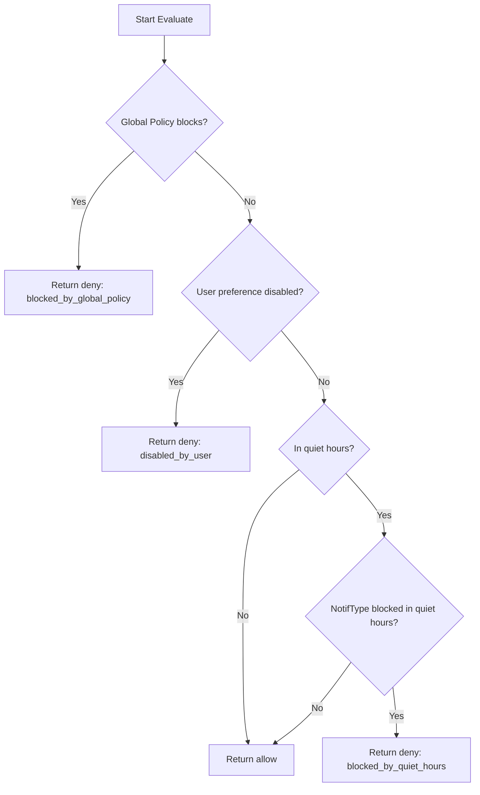

# Implementation Plan: Notification Preferences Service

## Overview

Implementation plan for Notification Preferences Service based on ADR decisions.
Testing excluded - separate plan will cover it.

## Prerequisites

- Docker running with Postgres (docker-compose.yml ready)
- Node.js project scaffolded with NestJS

## Implementation Steps

### 1. Install Dependencies

**Package:** `date-fns-tz` for timezone handling

```bash
npm i -S -E date-fns-tz
```

### 2. Create Domain Types

**Location:** `src/modules/preferences/types/`

**Files:**

#### `channel.enum.ts`

```typescript
export enum Channel {
  EMAIL = 'email',
  SMS = 'sms',
  PUSH = 'push',
  MESSENGER = 'messenger',
}
```

#### `region.enum.ts`

```typescript
export enum Region {
  EU = 'EU',
  US = 'US',
  RU = 'RU',
  APAC = 'APAC',
}
```

#### `notif-type.enum.ts`

```typescript
export enum NotifType {
  TRANSACTIONAL = 'transactional',
  MARKETING = 'marketing',
}
```

#### `index.ts` - barrel export

### 3. Create Type Definitions

**Location:** `src/modules/preferences/types/`

#### `channel-preference.type.ts`

```typescript
export interface ChannelPreference {
  enabled: boolean;
}
```

#### `quiet-hours.type.ts`

```typescript
export interface QuietHours {
  startTime: string; // HH:mm format
  endTime: string; // HH:mm format
  timezone: string; // IANA timezone
}
```

#### `user-preferences.interface.ts`

```typescript
export interface UserPreferencesData {
  [NotifType.TRANSACTIONAL]?: Record<Channel, ChannelPreference>;
  [NotifType.MARKETING]?: Record<Channel, ChannelPreference>;
}
```

### 4. Create Constants

**Location:** `src/modules/preferences/constants/`

#### `default-preferences.ts`

```typescript
export const DEFAULT_PREFERENCES: UserPreferencesData = {
  [NotifType.TRANSACTIONAL]: {
    [Channel.EMAIL]: { enabled: true },
    [Channel.SMS]: { enabled: true },
    [Channel.PUSH]: { enabled: true },
    [Channel.MESSENGER]: { enabled: true },
  },
  [NotifType.MARKETING]: {
    [Channel.EMAIL]: { enabled: false },
    [Channel.SMS]: { enabled: false },
    [Channel.PUSH]: { enabled: false },
    [Channel.MESSENGER]: { enabled: false },
  },
};
```

#### `global-policies.ts`

```typescript
export interface GlobalPolicy {
  id: string;
  notifType: NotifType;
  channel: Channel;
  region: Region;
  blocked: boolean;
  reason: string;
}

export const GLOBAL_POLICIES: GlobalPolicy[] = [
  {
    id: 'gdpr-marketing-sms',
    notifType: NotifType.MARKETING,
    channel: Channel.SMS,
    region: Region.EU,
    blocked: true,
    reason: 'GDPR compliance - marketing SMS blocked in EU',
  },
  {
    id: 'gdpr-marketing-push',
    notifType: NotifType.MARKETING,
    channel: Channel.PUSH,
    region: Region.EU,
    blocked: true,
    reason: 'GDPR compliance - marketing push blocked in EU',
  },
];
```

#### `quiet-hours-rules.ts`

```typescript
export const BLOCKED_IN_QUIET_HOURS: Record<NotifType, boolean> = {
  [NotifType.TRANSACTIONAL]: false,
  [NotifType.MARKETING]: true,
};
```

### 5. Create TypeORM Entity

**Location:** `src/modules/preferences/entities/user-preferences.entity.ts`

```typescript
@Entity('user_preferences')
export class UserPreferences {
  @PrimaryColumn('uuid')
  userId: string;

  @Column('jsonb')
  preferences: UserPreferencesData;

  @Column('jsonb', { nullable: true })
  quietHours: QuietHours | null;

  @CreateDateColumn()
  createdAt: Date;

  @UpdateDateColumn()
  updatedAt: Date;
}
```

### 6. Update Data Source

**File:** `src/data-source.ts`

Add entities path:

```typescript
entities: isTsNode
  ? ['src/**/*.entity.ts']
  : ['dist/**/*.entity.js'],
```

### 7. Create Database Migration

**Command:**

```bash
npm run migration:create src/migrations/CreateUserPreferencesTable
```

**Migration content:**

```sql
CREATE TABLE user_preferences (
  user_id UUID PRIMARY KEY,
  preferences JSONB NOT NULL,
  quiet_hours JSONB,
  created_at TIMESTAMP WITH TIME ZONE NOT NULL DEFAULT NOW(),
  updated_at TIMESTAMP WITH TIME ZONE NOT NULL DEFAULT NOW()
);
```

### 8. Create DTOs

**Location:** `src/modules/preferences/dto/`

#### `update-preferences.dto.ts`

```typescript
export class UpdatePreferencesDto {
  @IsOptional()
  preferences?: UserPreferencesData;

  @IsOptional()
  @ValidateNested()
  quietHours?: QuietHoursDto | null;
}
```

#### `quiet-hours.dto.ts`

```typescript
export class QuietHoursDto {
  @Matches(/^([01]\d|2[0-3]):([0-5]\d)$/)
  startTime: string;

  @Matches(/^([01]\d|2[0-3]):([0-5]\d)$/)
  endTime: string;

  @IsString()
  timezone: string; // IANA timezone
}
```

#### `evaluate-request.dto.ts`

```typescript
export class EvaluateRequestDto {
  @IsUUID()
  userId: string;

  @IsEnum(NotifType)
  notifType: NotifType;

  @IsEnum(Channel)
  channel: Channel;

  @IsEnum(Region)
  region: Region;

  @IsISO8601()
  datetime: string;
}
```

#### `evaluate-response.dto.ts`

```typescript
export class EvaluateResponseDto {
  decision: 'allow' | 'deny';
  reason?: string;
}
```

#### `user-preferences-response.dto.ts`

```typescript
export class UserPreferencesResponseDto {
  userId: string;
  preferences: UserPreferencesData;
  quietHours: QuietHours | null;
  createdAt: Date;
  updatedAt: Date;
}
```

### 9. Implement PreferencesService

**Location:** `src/modules/preferences/preferences.service.ts`

**Methods:**

1. `getPreferences(userId: string): Promise<UserPreferencesResponseDto>`
   - Find by userId
   - If not found, create with defaults
   - Return DTO

2. `updatePreferences(userId: string, dto: UpdatePreferencesDto): Promise<UserPreferencesResponseDto>`
   - Find or create preferences
   - Merge updates (idempotent - compare before update)
   - Save and return

3. `evaluate(dto: EvaluateRequestDto): Promise<EvaluateResponseDto>`
   - Check global policies (priority 1)
   - Check user preferences (priority 2)
   - Check quiet hours (priority 3)
   - Return decision with reason

**Helper methods:**

- `isInQuietHours(quietHours: QuietHours, datetime: Date): boolean`
  - Use date-fns-tz to convert time
  - Check if datetime falls within quiet hours range

- `findGlobalPolicy(notifType, channel, region): GlobalPolicy | undefined`

### 10. Implement PreferencesController

**Location:** `src/modules/preferences/preferences.controller.ts`

**Single controller with all endpoints:**

```typescript
@Controller()
@ApiTags('preferences')
export class PreferencesController {
  // GET /users/:userId/preferences
  @Get('users/:userId/preferences')
  async getPreferences(@Param('userId') userId: string): Promise<UserPreferencesResponseDto>

  // POST /users/:userId/preferences
  @Post('users/:userId/preferences')
  async updatePreferences(
    @Param('userId') userId: string,
    @Body() dto: UpdatePreferencesDto
  ): Promise<UserPreferencesResponseDto>

  // POST /evaluate
  @Post('evaluate')
  async evaluate(@Body() dto: EvaluateRequestDto): Promise<EvaluateResponseDto>
}
```

**Swagger decorators:**

- `@ApiTags('preferences')`
- `@ApiOperation()`
- `@ApiResponse()`

### 11. Create PreferencesModule

**Location:** `src/modules/preferences/preferences.module.ts`

```typescript
@Module({
  imports: [TypeOrmModule.forFeature([UserPreferences])],
  controllers: [PreferencesController],
  providers: [PreferencesService],
  exports: [PreferencesService],
})
export class PreferencesModule {}
```

### 12. Update AppModule

**File:** `src/app.module.ts`

```typescript
imports: [
  TypeOrmModule.forRoot(dataSourceOptions),
  PreferencesModule,
],
```

### 13. Implement Seed Script

**File:** `src/database/run-seed.ts`

**Test data:**

**User 1:** `a0eebc99-9c0b-4ef8-bb6d-6bb9bd380a11`

- Default preferences
- Quiet hours: 22:00-08:00 Europe/Moscow

**User 2:** `b1ffcd00-0d1c-5fg9-cc7e-7cc0ce491b22`

- Marketing email enabled
- No quiet hours

### 14. Run Migration and Seed

```bash
# Start Postgres
docker-compose up -d

# Run migration
npm run migration:run

# Run seed
npm run db:seed
```

### 15. Manual API Testing

Use httpie to test endpoints:

```bash
# Get preferences
http GET http://localhost:3000/users/a0eebc99-9c0b-4ef8-bb6d-6bb9bd380a11/preferences

# Update preferences
http POST http://localhost:3000/users/a0eebc99-9c0b-4ef8-bb6d-6bb9bd380a11/preferences preferences:='{"marketing":{"email":{"enabled":true}}}'

# Evaluate
http POST http://localhost:3000/evaluate userId=a0eebc99-9c0b-4ef8-bb6d-6bb9bd380a11 notifType=marketing channel=email region=EU datetime=2026-05-21T21:30:00Z
```

## File Structure After Implementation

```
src/
├── modules/
│   └── preferences/
│       ├── preferences.module.ts
│       ├── preferences.controller.ts
│       ├── preferences.service.ts
│       ├── constants/
│       │   ├── default-preferences.ts
│       │   ├── global-policies.ts
│       │   └── quiet-hours-rules.ts
│       ├── dto/
│       │   ├── index.ts
│       │   ├── quiet-hours.dto.ts
│       │   ├── update-preferences.dto.ts
│       │   ├── evaluate-request.dto.ts
│       │   ├── evaluate-response.dto.ts
│       │   └── user-preferences-response.dto.ts
│       ├── entities/
│       │   └── user-preferences.entity.ts
│       └── types/
│           ├── index.ts
│           ├── channel.enum.ts
│           ├── region.enum.ts
│           ├── notif-type.enum.ts
│           ├── channel-preference.type.ts
│           ├── quiet-hours.type.ts
│           └── user-preferences.interface.ts
├── migrations/
│   └── [timestamp]-CreateUserPreferencesTable.ts
├── database/
│   └── run-seed.ts (updated)
├── app.module.ts (updated)
└── data-source.ts (updated)
```

## Decision Flow for Evaluate Endpoint



## Notes

- Idempotency: Update compares current state before saving
- Timezone handling: Use date-fns-tz for all timezone conversions
- JSONB validation: Service validates JSONB structure on read/write
- Swagger: All endpoints documented with @ApiOperation, @ApiResponse
