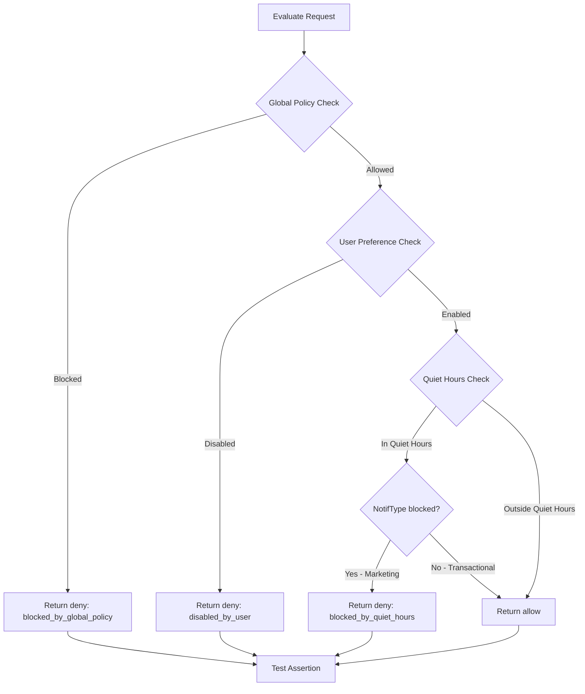

# Testing Implementation Plan

## Overview

This plan covers implementation of unit tests for Notification Preferences Service based on PRD requirements.

**Decision:** E2E tests removed. Business logic concentrated in PreferencesService. Unit tests with mocked repository sufficient for coverage.

## Unit Tests - PreferencesService

Location: `src/modules/preferences/preferences.service.spec.ts`

### 1.1 Default Preferences for New User

Test cases:

- `getPreferences` creates new record with default preferences when user not found
- Default preferences match `DEFAULT_PREFERENCES` constant
- Returns correct DTO structure with userId, preferences, quietHours, timestamps

### 1.2 User Preference Changes

Test cases:

- `updatePreferences` merges partial preferences with existing
- `updatePreferences` creates new record if user not exists
- `updatePreferences` sets quietHours when provided
- `updatePreferences` clears quietHours when null provided
- Returns updated preferences in response

### 1.3 Quiet Hours Influence

Test cases:

- `isInQuietHours` returns true when time is within range
- `isInQuietHours` returns false when time is outside range
- `isInQuietHours` handles overnight range correctly - e.g. 22:00 to 08:00
- `isInQuietHours` handles timezone conversion correctly
- `evaluate` returns deny with reason blocked_by_quiet_hours when marketing notification during quiet hours
- `evaluate` returns allow for transactional during quiet hours

### 1.4 Global Policies Influence

Test cases:

- `findGlobalPolicy` returns correct policy for matching notifType, channel, region
- `findGlobalPolicy` returns undefined when no policy matches
- `evaluate` returns deny with reason blocked_by_global_policy when global policy blocks
- Global policy takes priority over user preferences

### 1.5 Idempotency

Test cases:

- `updatePreferences` does not save when state already matches request
- `updatePreferences` returns same result for repeated identical requests
- Logger not called when no actual change occurs

---

## Test Fixtures

Location: `src/modules/preferences/preferences.service.spec.ts` (inline) or separate fixtures file

```typescript
// Valid UUIDs for testing
export const TEST_USER_ID = '550e8400-e29b-41d4-a716-446655440000';
export const ANOTHER_USER_ID = '550e8400-e29b-41d4-a716-446655440001';

// Sample preferences
export const SAMPLE_PREFERENCES = {
  transactional: {
    email: { enabled: true },
    sms: { enabled: true },
    push: { enabled: true },
    messenger: { enabled: true },
  },
  marketing: {
    email: { enabled: false },
    sms: { enabled: false },
    push: { enabled: false },
    messenger: { enabled: false },
  },
};

// Sample quiet hours
export const SAMPLE_QUIET_HOURS = {
  startTime: '22:00',
  endTime: '08:00',
  timezone: 'Europe/Moscow',
};
```

---

## Test Data Scenarios

### Scenario 1: New User Defaults

```typescript
// Given: User does not exist in database
// When: getPreferences called
// Then: Returns default preferences, creates record in DB
```

### Scenario 2: User Disables Marketing Email

```typescript
// Given: User exists with default preferences
// When: updatePreferences with { preferences: { marketing: { email: { enabled: false } } } }
// Then: Marketing email disabled, transactional unchanged
```

### Scenario 3: Quiet Hours Block Marketing Push

```typescript
// Given: User has quiet hours 22:00-08:00 Europe/Moscow
// When: evaluate with { notifType: 'marketing', channel: 'push', datetime: '2026-05-21T23:00:00Z' }
// Then: Returns { decision: 'deny', reason: 'blocked_by_quiet_hours' }
```

### Scenario 4: Global Policy Blocks EU Marketing SMS

```typescript
// Given: Global policy blocks marketing SMS in EU
// When: evaluate with { notifType: 'marketing', channel: 'sms', region: 'EU' }
// Then: Returns { decision: 'deny', reason: 'blocked_by_global_policy' }
```

### Scenario 5: Idempotent Update

```typescript
// Given: User has marketing email disabled
// When: updatePreferences with { preferences: { marketing: { email: { enabled: false } } } }
// Then: No database write, returns current state
```

---

## Implementation Order

1. Create test fixtures inline or in separate file
2. Setup mock repository and module
3. Implement tests for each category
4. Run tests and verify coverage

---

## Test Commands

```bash
# Run unit tests
npm run test

# Run unit tests with coverage
npm run test:cov

# Run unit tests in watch mode
npm run test:watch
```

---

## Coverage Goals

Target coverage for PreferencesService:

- Statements: 90%+
- Branches: 85%+
- Functions: 90%+
- Lines: 90%+

---

## Mermaid Diagram: Evaluate Decision Flow Test Cases



---

## Files to Create

| File                                                  | Purpose                |
| ----------------------------------------------------- | ---------------------- |
| `src/modules/preferences/preferences.service.spec.ts` | Unit tests for service |

---

## Notes

- Use valid RFC 4122 UUIDs in test fixtures
- Use date-fns for date operations
- Mock Logger in unit tests to avoid console noise
- Mock Repository to isolate service logic
