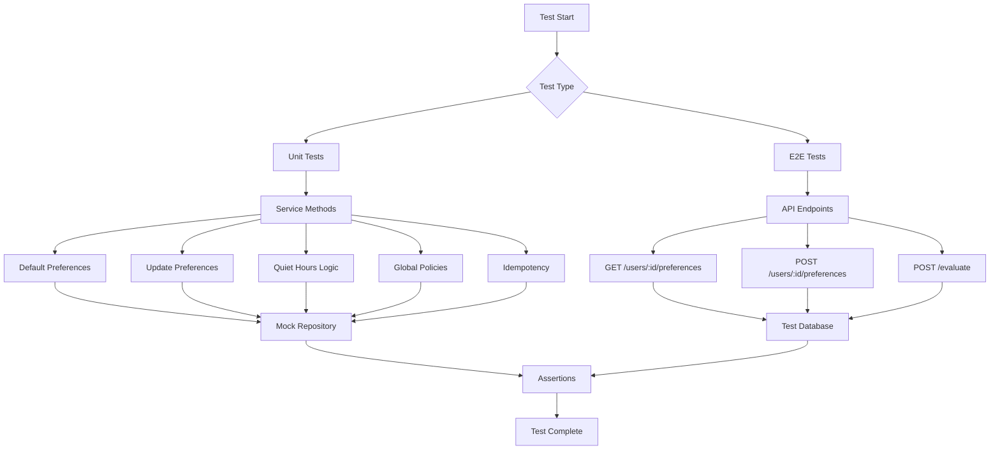
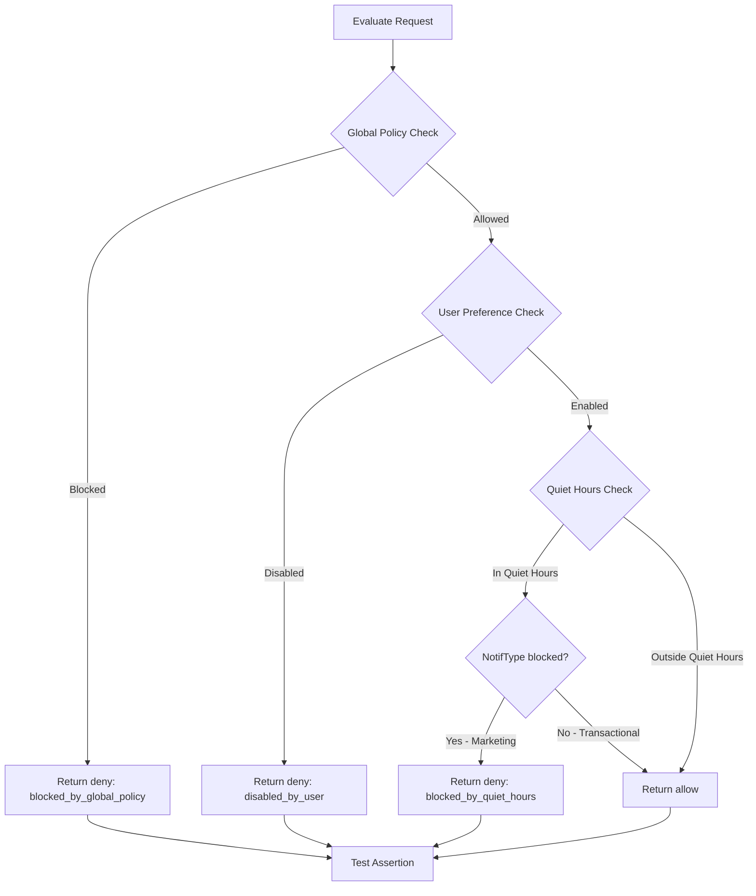

# Testing Implementation Plan

## Overview

This plan covers implementation of tests for Notification Preferences Service based on PRD requirements.

## Test Categories

### 1. Unit Tests - PreferencesService

Location: `src/modules/preferences/preferences.service.spec.ts`

#### 1.1 Default Preferences for New User

Test cases:

- `getPreferences` creates new record with default preferences when user not found
- Default preferences match `DEFAULT_PREFERENCES` constant
- Returns correct DTO structure with userId, preferences, quietHours, timestamps

#### 1.2 User Preference Changes

Test cases:

- `updatePreferences` merges partial preferences with existing
- `updatePreferences` creates new record if user not exists
- `updatePreferences` sets quietHours when provided
- `updatePreferences` clears quietHours when null provided
- Returns updated preferences in response

#### 1.3 Quiet Hours Influence

Test cases:

- `isInQuietHours` returns true when time is within range
- `isInQuietHours` returns false when time is outside range
- `isInQuietHours` handles overnight range correctly - e.g. 22:00 to 08:00
- `isInQuietHours` handles timezone conversion correctly
- `evaluate` returns deny with reason blocked_by_quiet_hours when marketing notification during quiet hours
- `evaluate` returns allow for transactional during quiet hours

#### 1.4 Global Policies Influence

Test cases:

- `findGlobalPolicy` returns correct policy for matching notifType, channel, region
- `findGlobalPolicy` returns undefined when no policy matches
- `evaluate` returns deny with reason blocked_by_global_policy when global policy blocks
- Global policy takes priority over user preferences

#### 1.5 Idempotency

Test cases:

- `updatePreferences` does not save when state already matches request
- `updatePreferences` returns same result for repeated identical requests
- Logger not called when no actual change occurs

---

### 2. E2E Tests - API Endpoints

Location: `test/preferences.e2e-spec.ts`

#### 2.1 GET /users/:userId/preferences

Test cases:

- Returns 200 with user preferences for existing user
- Returns 200 with default preferences for new user
- Returns correct DTO structure

#### 2.2 POST /users/:userId/preferences

Test cases:

- Returns 200 with updated preferences
- Updates specific channel preference
- Updates quiet hours settings
- Clears quiet hours when null sent
- Idempotent - same request twice returns same result

#### 2.3 POST /evaluate

Test cases:

- Returns allow when all conditions pass
- Returns deny with blocked_by_global_policy reason
- Returns deny with disabled_by_user reason
- Returns deny with blocked_by_quiet_hours reason
- Handles timezone correctly in datetime evaluation

---

## Test Infrastructure

### Database Setup for E2E Tests

Options:

1. **In-memory SQLite** - Fast, isolated, but different from production PostgreSQL
2. **Test PostgreSQL container** - Same as production, but slower setup
3. **Mock repository** - Fast, but less integration coverage

Recommendation: Use **test PostgreSQL** with separate test database for E2E tests to match production behavior.

### Test Configuration

Create: `test/jest-e2e.json` update or `test/test-setup.ts`

```json
{
  "moduleFileExtensions": ["js", "json", "ts"],
  "rootDir": ".",
  "testEnvironment": "node",
  "testRegex": ".e2e-spec.ts$",
  "transform": {
    "^.+\\.(t|j)s$": "ts-jest"
  },
  "setupFilesAfterEnv": ["./test-setup.ts"]
}
```

### Test Fixtures

Create: `test/fixtures/preferences.fixture.ts`

```typescript
// Valid UUIDs for testing
export const TEST_USER_ID = '550e8400-e29b-41d4-a716-446655440000';
export const ANOTHER_USER_ID = '550e8400-e29b-41d4-a716-446655440001';

// Sample preferences
export const SAMPLE_PREFERENCES = {
  transactional: {
    email: { enabled: true },
    sms: { enabled: true },
    push: { enabled: true },
    messenger: { enabled: true },
  },
  marketing: {
    email: { enabled: false },
    sms: { enabled: false },
    push: { enabled: false },
    messenger: { enabled: false },
  },
};

// Sample quiet hours
export const SAMPLE_QUIET_HOURS = {
  startTime: '22:00',
  endTime: '08:00',
  timezone: 'Europe/Moscow',
};
```

---

## Test Data Scenarios

### Scenario 1: New User Defaults

```typescript
// Given: User does not exist in database
// When: GET /users/:userId/preferences called
// Then: Returns default preferences, creates record in DB
```

### Scenario 2: User Disables Marketing Email

```typescript
// Given: User exists with default preferences
// When: POST /users/:userId/preferences with { preferences: { marketing: { email: { enabled: false } } } }
// Then: Marketing email disabled, transactional unchanged
```

### Scenario 3: Quiet Hours Block Marketing Push

```typescript
// Given: User has quiet hours 22:00-08:00 Europe/Moscow
// When: POST /evaluate with { notifType: 'marketing', channel: 'push', datetime: '2026-05-21T23:00:00Z' }
// Then: Returns { decision: 'deny', reason: 'blocked_by_quiet_hours' }
```

### Scenario 4: Global Policy Blocks EU Marketing SMS

```typescript
// Given: Global policy blocks marketing SMS in EU
// When: POST /evaluate with { notifType: 'marketing', channel: 'sms', region: 'EU' }
// Then: Returns { decision: 'deny', reason: 'blocked_by_global_policy' }
```

### Scenario 5: Idempotent Update

```typescript
// Given: User has marketing email disabled
// When: POST /users/:userId/preferences with { preferences: { marketing: { email: { enabled: false } } } }
// Then: No database write, returns 200 with current state
```

---

## Implementation Order

1. Create test fixtures file
2. Implement unit tests for PreferencesService
3. Setup test database configuration for E2E
4. Implement E2E tests for API endpoints
5. Run all tests and verify coverage

---

## Test Commands

```bash
# Run unit tests
npm run test

# Run unit tests with coverage
npm run test:cov

# Run E2E tests
npm run test:e2e
```

---

## Coverage Goals

Target coverage for PreferencesService:

- Statements: 90%+
- Branches: 85%+
- Functions: 90%+
- Lines: 90%+

---

## Mermaid Diagram: Test Flow



---

## Mermaid Diagram: Evaluate Decision Flow Test Cases



---

## Files to Create

| File                                                  | Purpose                  |
| ----------------------------------------------------- | ------------------------ |
| `src/modules/preferences/preferences.service.spec.ts` | Unit tests for service   |
| `test/preferences.e2e-spec.ts`                        | E2E tests for API        |
| `test/fixtures/preferences.fixture.ts`                | Test data fixtures       |
| `test/test-setup.ts`                                  | Test configuration setup |

---

## Notes

- Use valid RFC 4122 UUIDs in test fixtures per testing_rules.md
- Use date-fns for date operations per react_rules.md
- Mock Logger in unit tests to avoid console noise
- Clean database between E2E tests for isolation
